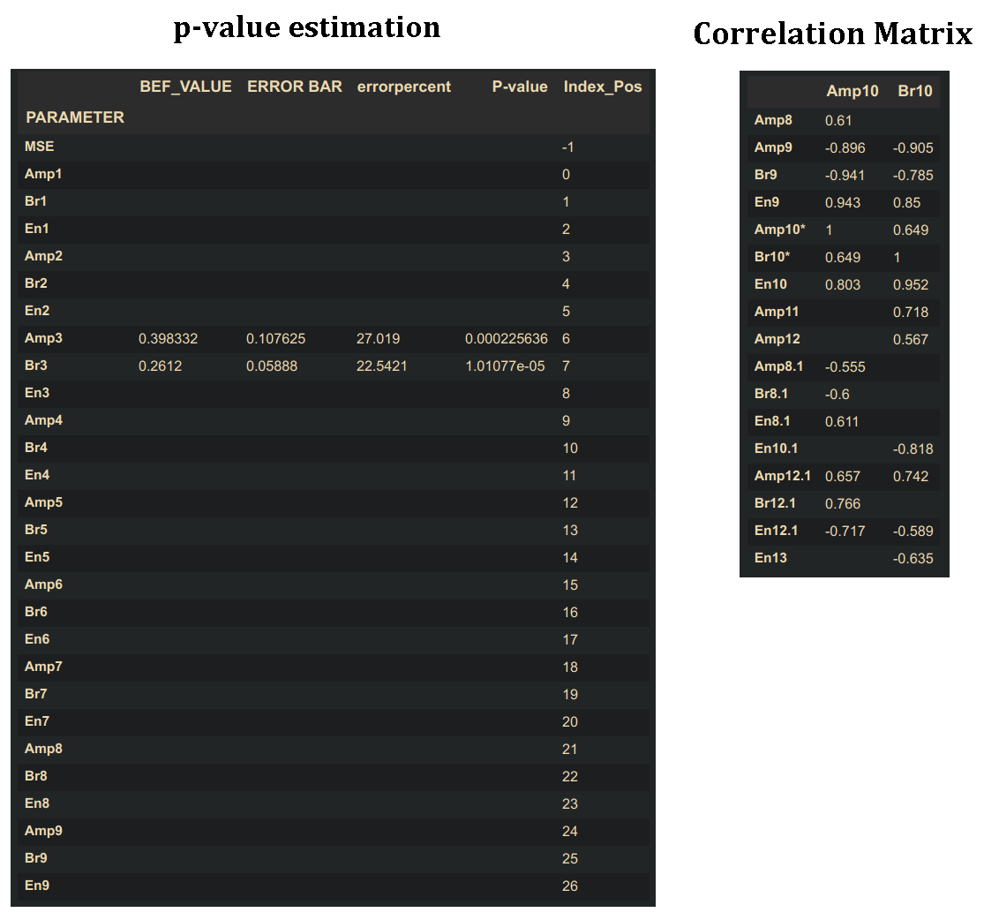

# Ellipsometry_Stat_Analysis
Code for analysing the statistical significance of the fit parameters  obtained from fitting dielectric function models to spectroscopic ellipsometry data in CompleteEASE software (J.A.Woollam Company) by estimating p-values and checking the correlation between parameters

